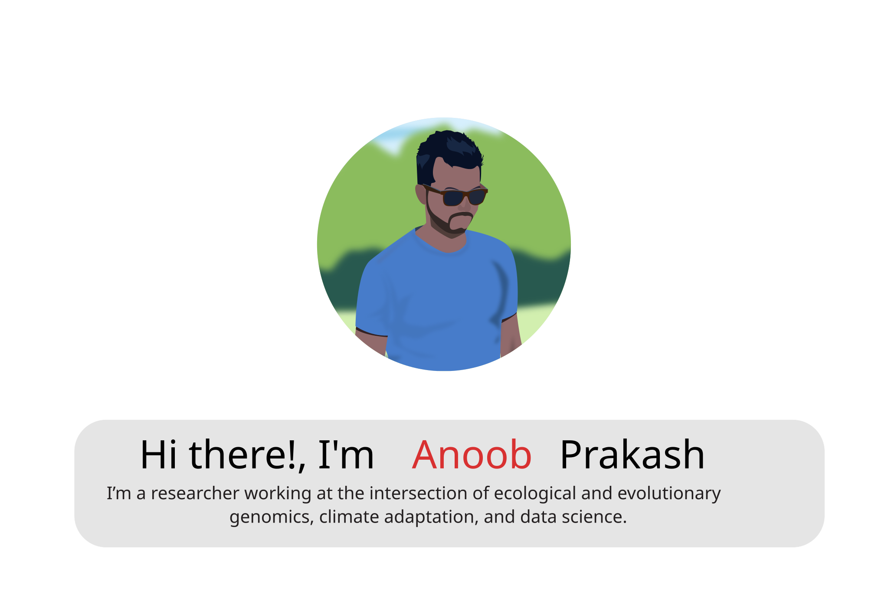
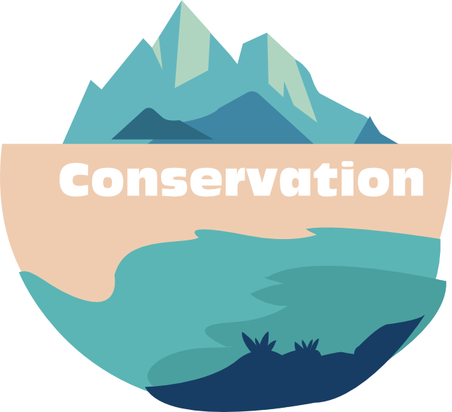
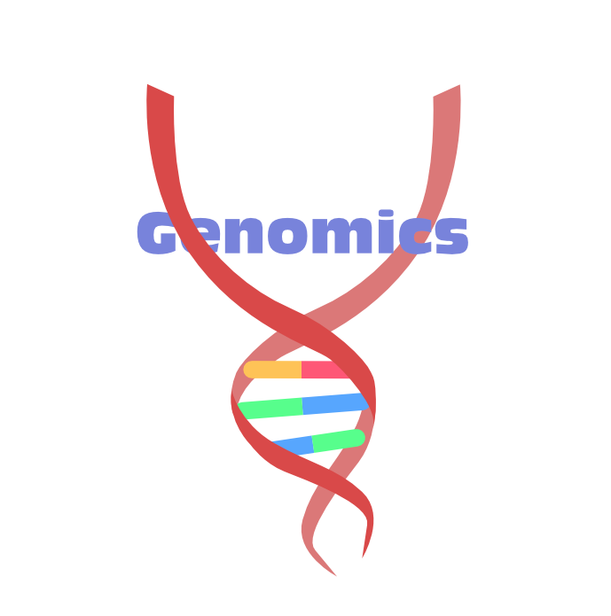
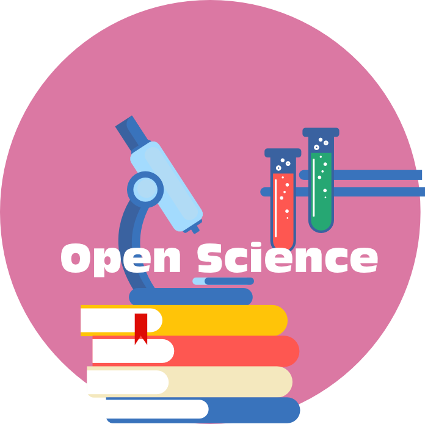
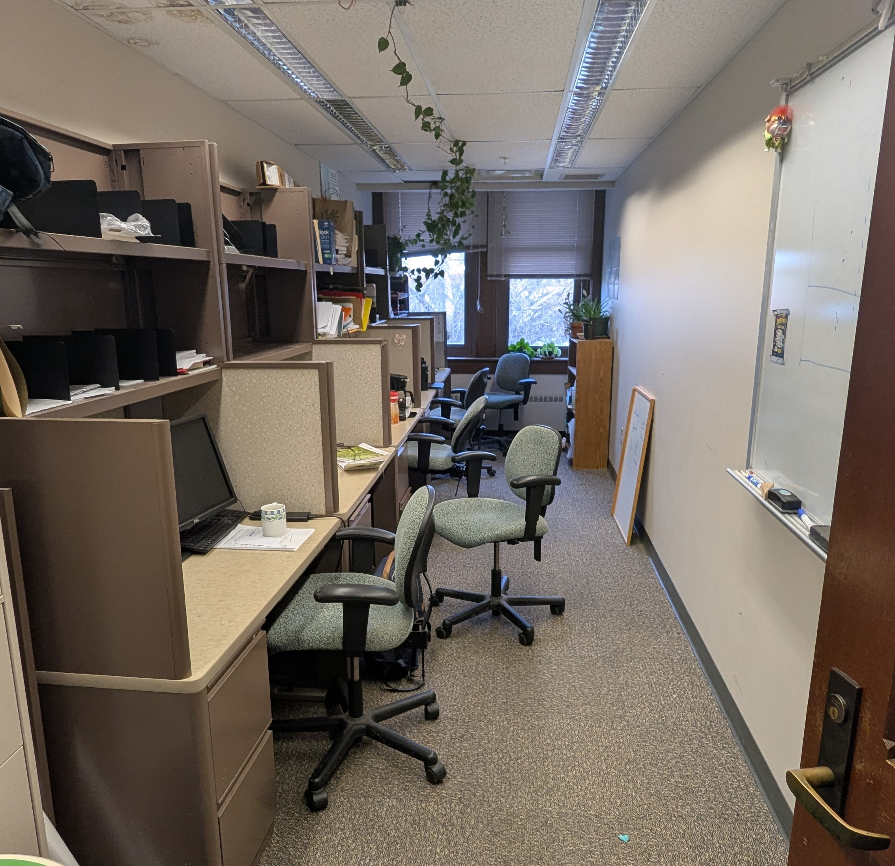
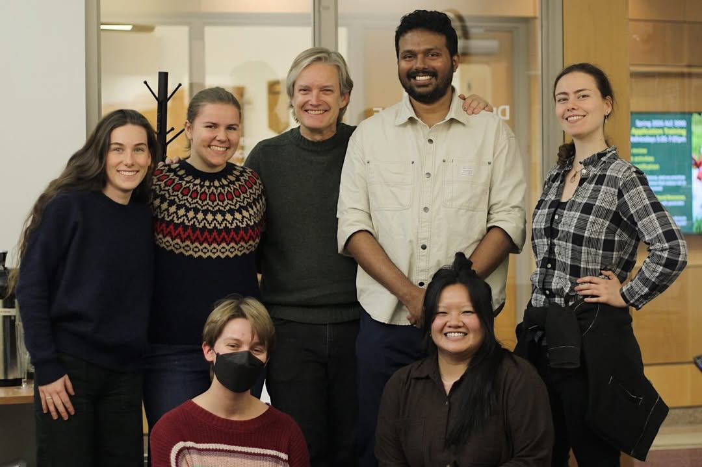
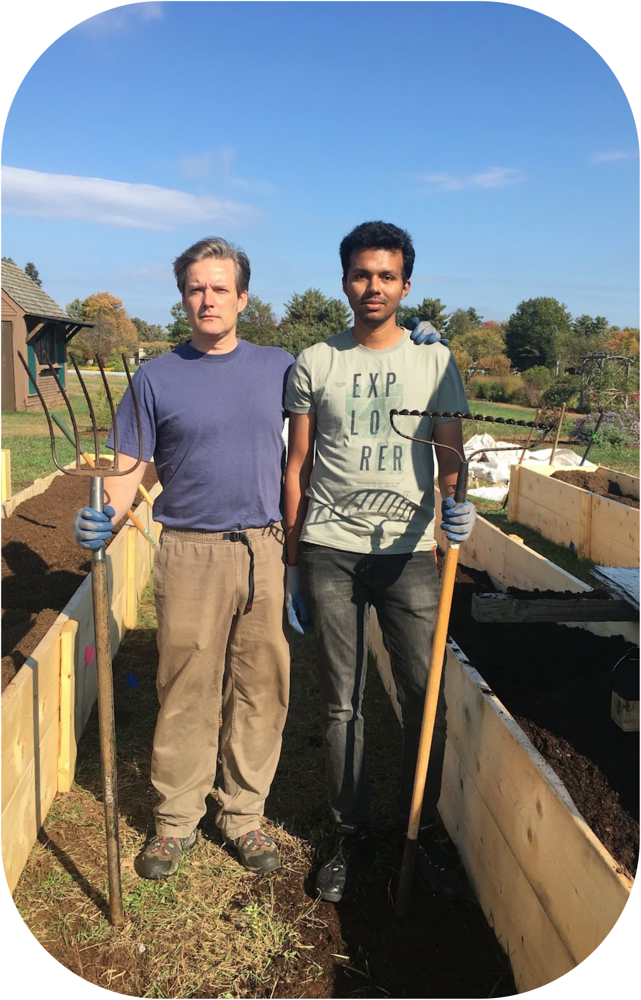
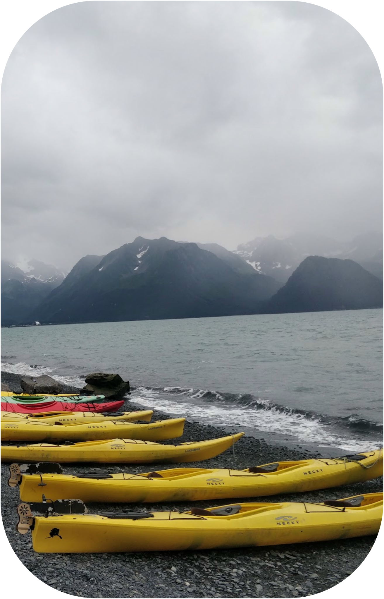
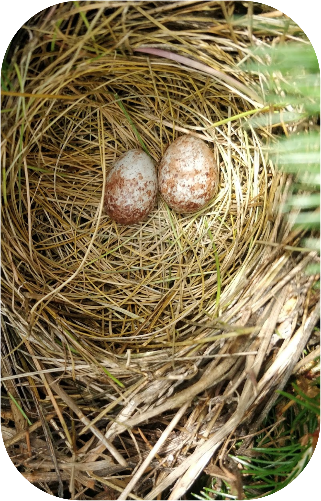

<!-- ::: {.column-screen} -->
<!-- 
<!--      style="display:block; width:auto; height:auto; margin:0; padding:0;"> -->
<!-- :::  -->

::: {.column-screen}

::: 

::: {.column-screen}

::: {.photo-grid2}

:::

:::

  

::: {.column-page}
::: {.cv-section}
::::: {layout="[ 30, 70 ]"}
::: {#first-column}

{.about-photo width=30%}

:::
::: {#second-column}

[A little bit about me]{style="font-size: 1.6rem; font-weight: 600; display: block; margin-bottom: 0.25rem; color: #b82601;"}

[I’m a plant biologist and forest genomicist who spends a lot of time thinking about how trees will cope with a rapidly changing climate. I utilize large genomic and environmental datasets to understand – and hopefully help guide **the future of forests**.]{style="font-size: 1.3rem; font-weight: 400; display: block; margin-bottom: 0.25rem; color: #6fb3b8;"} 

[**More >>**](about.qmd)

[Please reach out to me if you like to discuss science or collaborate or to just chill over a game of basketball or co-op gaming.]{style="font-size: 1.3rem; font-weight: 400; display: block; margin-bottom: 0.25rem; color: #6fb3b8;"}

  
  
  
  
  

:::
:::::
:::
:::

<!---start news here --->

::: {.column-page}

[News and updates]{style="font-size: 2.0rem; font-weight: 600; display: block; margin-bottom: 0.25rem; color: #cfd217"}

::::: {layout="[ 20, 80 ]"}
::: {#first-column}

{width=30% .lightbox group="news"}

:::
::: {#second-column}

[Jan 20th, 2026]{style="font-size: 1.2rem; font-weight: 600; display: block; margin-bottom: 0.25rem; color: #b82601;"}  

Joined Purdue University as a Post doctoral research associate under Dr. Matthew Ginzel and Dr. Vikram Chhatre to investigate climate change adaptation and potential pre- or mal-adaptation of eastern hardwoods. The project objectives are in alignment with the goals of [HTIRC](https://htirc.org/).

:::
:::::

::::: {layout="[ 20, 80 ]"}
::: {#first-column}

{width=30% .lightbox group="news"}

:::
::: {#second-column}

[Nov 14th, 2025]{style="font-size: 1.2rem; font-weight: 600; display: block; margin-bottom: 0.25rem; color: #b82601;"}  

Successfully defended my PhD titled "Range wide genotypic and phenotypic variation and climate change adaptation in red spruce". Bringing one of the most wonderful chapters in my life to an end.

:::
:::::

:::

::: {.column-screen}

:::

<!---footer figs --->

:::::: {.column-body}
::::: {layout="[ 20,20,20,20 ]"}
::: {#first-column}
{.about-photo width=30%}
:::
::: {#second-column}
{.about-photo width=30%}
:::
::: {#third-column}
{.about-photo width=30%}
:::
::: {#fourth-column}
{.about-photo width=30%}
:::
:::::
::::::

<!-- ::: {.column-full} -->
<!-- ::: {#bio} -->
<!-- [Hi there! I'm Anoob Prakash]{style="font-size: 2.6rem; font-weight: 600; display: block; margin-bottom: 0.25rem; color: #b82601;"} -->

<!-- [Welcome to my personal website. I’m a researcher working at the intersection of ecological and evolutionary genomics, climate adaptation, and bioinformatics. I am interested in applying data science skills to analyze large-scale genomic datasets to understand how species respond to a changing climate. Learn more [about me](about.qmd). On this site, you’ll find my research, projects in data visualization and analysis, and other interests.]{style="font-size: 1.6rem; font-weight: 400; display: block; margin-bottom: 0.25rem; color: #6fb3b8;"} -->
<!-- ::: -->
<!-- ::: -->

