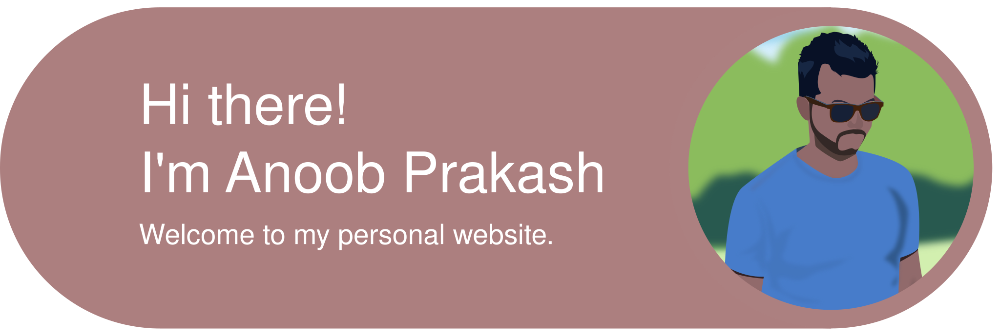

<!-- ::: {.column-screen} -->
<!-- 
<!--      style="display:block; width:auto; height:auto; margin:0; padding:0;"> -->
<!-- :::  -->

::: {.column-screen}

::: 

::: {.column-screen}

::: {.photo-grid2}

:::

:::

<!-- ::: {.column-page} -->

<!-- 
 -->
<!--    -->
<!-- 
 -->
<!-- ::: -->

::: {.column-page}
::: {.cv-section}
::::: {layout="[ 30, 70 ]"}
::: {#first-column}

  <!-- {.about-photo width=10%} -->

:::
::: {#second-column}

[A little bit about me]{style="font-size: 1.6rem; font-weight: 600; display: block; margin-bottom: 0.25rem; color: #8775B8;"}

[I’m a plant biologist and forest geneticist who spends a lot of time thinking about how trees will cope with a rapidly changing climate. I utilize large genomic and environmental datasets to understand – and hopefully help guide **the future of forests**.]{style="font-size: 1rem; font-weight: 400; display: block; margin-bottom: 0.25rem; color: #6fb3b8;"} 

[**More >>**](about/index.qmd)

  
  
  
  
  

:::
:::::
:::
:::

:::: {.column-page}

::: {.cv-section}



:::

::::

