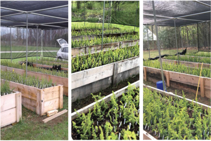
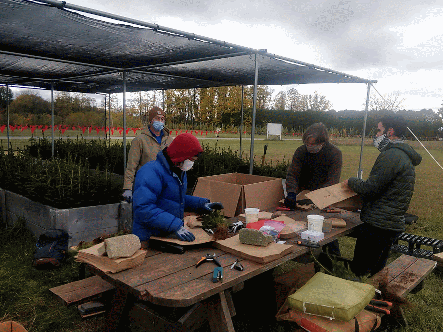
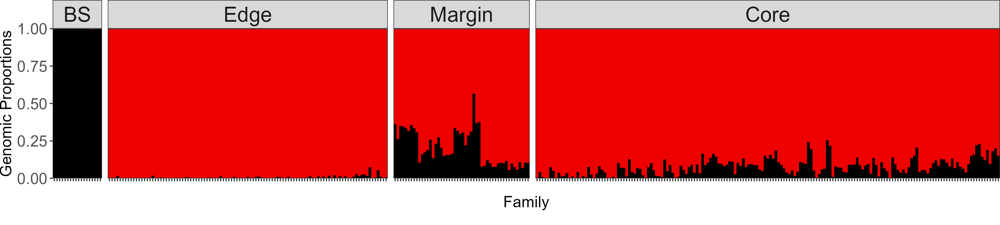
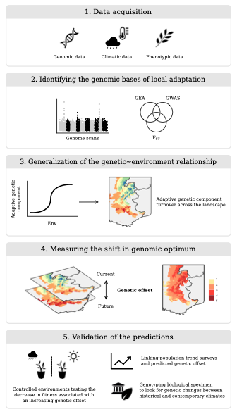
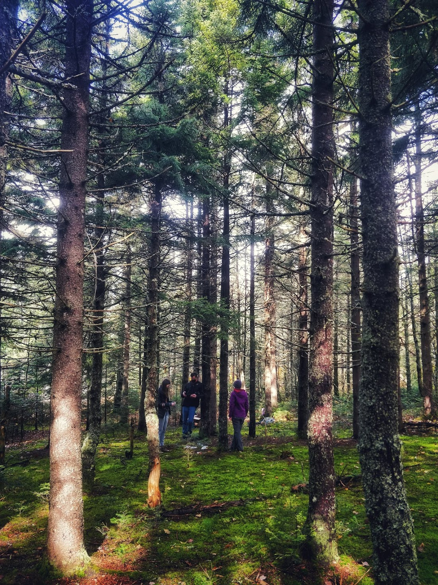
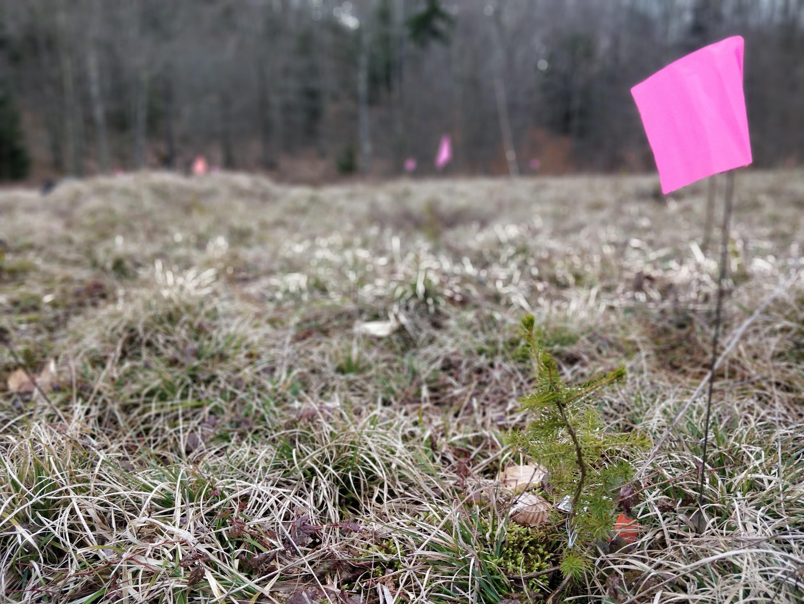

:::{.column-screen}
# Adaptation and response to environmental change    
_~ the questions that drive me_  
{.title-photo width=100%}

:::


::::: column-screen
::: {.cv-hero}
<div class="cv-name">Climate change adaptation in trees</div>
<div class="cv-title">**Status**: _Ongoing_ · **Publication**: [Prakash et al. (2022)](https://doi.org/10.1098/rstb.2021.0008)</div>
:::
::::: 

::::: column-screen

::::: {layout="[ 50, 50 ]"}
::: {#first-column}

::: {.cv-section}
#### Background  
Species distributions are shaped by a combination of historical and contemporary processes, including past range expansions, migration, and patterns of adaptation to diverse environmental conditions across their ranges. Today, global climate change is a major driver of new changes in species distributions. 

Warming temperatures, shifting precipitation patterns, and more frequent climate extremes have led to widespread responses like altered phenology, range shifts, and physiological changes observed across many taxa. Long-lived, sessile organisms like trees are especially vulnerable because their migration and adaptation rates cannot keep pace with rapid climate changes.  


:::
:::
::: {#second-column}

::: {.cv-section}
#### Red spruce  

I used multidisciplinary approaches to understand the genotypic and phenotypic variation and climate change adaptation present in red spruce (Picea rubens Sarg.), a climate sensitive conifer species found in eastern North America. Red spruce populations have declined over the past century due to logging, acid rain, climate stress, and exhibit low genetic diversity, particularly in the fragmented southern part of its range. To assess genetic and environmental influences on key traits like phenology and growth, I planted seeds from across the species range in three common gardens (Vermont, Maryland, and North Carolina) and performed whole-genome exome capture of mother trees. Genetic analysis revealed moderate heritability and regional differentiation for phenology and growth, alongside high plasticity.   

:::
:::
:::::
:::::

::::: column-screen
::: {.cv-section}

```{r setup, include=FALSE}
knitr::opts_chunk$set(echo = TRUE)
```

 
```{r message=FALSE, warning=FALSE, paged.print=FALSE, echo=F}
#| cache: true
# packages  
suppressPackageStartupMessages({
  require(sp)
  require(leaflet)
})

# data
meta <- read.csv("spruce/data/RS_Exome_metadata.txt",
                 header=T,
                 sep="\t")
Fam <- meta[,c("Pop","Family","Region","Latitude","Longitude","Elevation")]
Fam$Longitude <- Fam$Longitude * -1
Fam$Region <- plyr::revalue(Fam$Region,
                               c("C" = "Core", "M" = "Margin", "E" = "Edge"))

Fam$Region <- factor(Fam$Region,levels = c("Core", "Margin", "Edge"))

Garden <- data.frame("Garden"   = c("Vermont","Maryland","North_Carolina"),
                     "Latitude" = c(44.4759,39.642483,35.504163),
                     "Longitude"= c(-73.2121,-78.939213,-82.5995),
                     "Elevation"= c(59,588,665))

data <- Fam[,c(3:6)]
g2 <- Garden
names(g2)[1] <- "Region"
data <- rbind(data,g2)


## range cover of red spruce

range <- raster::shapefile("spruce/data/rangemap/picerube/picerube.shp")

# sp::proj4string(range) # describes data’s current coordinate reference system

# to change to correct projection:
range <- spTransform(range,
                     CRS("+proj=longlat +datum=WGS84"))


# leaflet  

map <- leaflet(data = range)


pal <- colorFactor(c("goldenrod2","green2","steelblue"), domain = c("Core", "Margin","Edge"))


map %>%
  # setView(lng = -70 ,lat= 43, zoom = 5.3) %>%
  setMaxBounds(lng1 = -76.5, lat1 = 41.5, 
               lng2 = -74,
               lat2 = 41 ) %>% 
  addProviderTiles("OpenTopoMap") %>% 
  addPolygons(
    stroke = FALSE,
    fillOpacity = 0.7,
    smoothFactor = 0.1,
    color="red"
    ) %>% 
  
  addCircleMarkers(
    data = Fam, 
    lng=~Longitude,
    lat=~Latitude,
    color = "black",
    radius=5,
    stroke=T,
    weight = 0.8,
    fillColor =~pal(Region),
    fillOpacity = 0.9,
    popup = paste0("<strong>Population: </strong>", Fam$Pop, "</br>",
                   "<strong>Family: </strong>", Fam$Family)
) %>% 
  addCircleMarkers(
    data = Garden, 
    lng=~Longitude,
    lat=~Latitude,
    color = "black",
    radius=8,
    stroke=T,
    weight = 0.8,
    fillColor ="grey50",
    fillOpacity = 0.9,
    popup = paste0("<strong>Garden site: </strong>", Garden$Garden, "</br>",
                   "<strong>Elevation: </strong>", Garden$Elevation)
) %>% 
  addPopups(data = Garden, 
    lng=~Longitude,
    lat=~Latitude, Garden$Garden,
    options = popupOptions(closeButton = T)
  ) %>% 
  addLegend('bottomright', pal = pal, values = Fam$Region,
            title = 'Region',
            opacity = 1)

```


:::
:::::


::::: column-screen 
::::: {layout="[ 50, 50 ]"}

::: {#first-column}
::: {.cv-section}

#### Genotypic and phenotypic variations in RS  

The common gardens were raised for 2 years, recording their phenotypic and phenological traits and harvested for biomass and isotope analysis. The results of the common garden experiment to investigate the phenotypic plasticity and genotypic variations in red spruce was published in 2022. The results of this paper laid the foundations for extending our understanding of the species and further apply it in the field.   

::: {.cv-hero}
<div class="cv-actions">
  [Paper](https://doi.org/10.1098/rstb.2021.0008){.btn .btn-outline-primary}
  
  [Code repo](https://github.com/anoobvinu07/NSF_RedSpruce_CG){.btn .btn-outline-primary}
  
  [Code html](https://anoobvinu07.github.io/NSF_RedSpruce_CG/){.btn .btn-outline-primary}
</div>
::: 

:::
:::

::: {#second-column}
::: {.cv-section}

#### Common gardens  

{.lightbox group="spruce"}   

{.lightbox group="spruce"}

:::
:::

:::::
:::::


::::: column-screen
::: {.cv-hero}
<div class="cv-name">Hybridization and Adaptive Introgression</div>
<div class="cv-title">**Status**: _Ongoing_ · **Publication**: _In prep_</div>
:::
::::: 

::::: column-screen

::::: {layout="[ 50, 50 ]"}
::: {#first-column}

::: {.cv-section}
#### Background  
We often think of species as being reproductively isolated from one another, this is not always the case. As a consequence of weak reproductive barriers, members of different species can interbreed in nature. When hybrids between two species are fertile, hybrids may then interbreed with members of the original species in a process known as backcrossing. Multiple generations of hybridization and subsequent backcrossing can facilitate the exchange of genetic material between parental species, a process known as introgression. 


:::
:::
::: {#second-column}

::: {.cv-section}
#### Introgression in red spruce  

Northern red spruce populations shows extensive introgression from black spruce (Picea mariana), which contributes adaptive genetic diversity for key traits such as biomass and height. These advanced-generation hybrids may play a key role in climate adaptation and evolutionary rescue for red spruce populations in a changing environment. This work advances our understanding of climate adaptation in red spruce and highlights the importance of introgression as a source of adaptive genetic diversity for vulnerable forest tree species.  

:::
:::
:::::
::::: 


::::: column-screen
::: {.cv-section}
Admix plot showing the introgression between red spruce and allopatric black spruce outside the current range of red spruce. 
{.panorama-photo width=100% .lightbox group="hybrid"}
:::
::::: 


## Genomic Forecasting

**Status:** Ongoing\
**Publications:** [Lachmuth et al. (2024) in Ecological Monographs](https://esajournals.onlinelibrary.wiley.com/doi/epdf/10.1002/ecm.1593)  

::::: column-screen
:::: column-margin
::: margin-photo
Genomic forecasting workflow. {.lightbox group="forecasting"}
:::
::::

Forecasting the responses of populations to climate change is a complex but important issue to understand as we face the potential for widespread climate maladaptation in the coming decades. This hits especially hard for long-lived, sessile organisms like forest trees, whose long-generation times and limited dispersal potential constrain the ability to adapt or track shifting climate. Recently, there has been increasing interest in combining genomics with climate models to forecast the short-term impacts of climate change on population adaptation. Our lab, in close collaboration with [Matt Fitzaptrick’s lab](https://mfitzpatrick.al.umces.edu/Site/Welcome.html) has been developing computational approaches to predict short-term disruption of climate adaptation, known as “genomic offset” modelling. Since first introducing the concept and statistical framework for genomic offset in 2015 ([Fitzpatrick and Keller, 2015](https://onlinelibrary.wiley.com/doi/full/10.1111/ele.12376)), we have worked to refine and extend the scope and application of offset models to predicting climate change maladaptation. This has involved simulation testing of genomic offset predictions, in collaboration with [Katie Lotterhos’ lab](https://sites.google.com/site/katielotterhos/home), as well as testing the sensitivity of offset models to model choices such as the genomic loci used and the climate variables and future projection scenarios ([Lachmuth et al., 2023](https://www.frontiersin.org/journals/ecology-and-evolution/articles/10.3389/fevo.2023.1155783/full)).

In addition to building and refining the computational pipeline of genomic offset for forecasting climate change responses, our lab has been working on empirical testing of offset predictions, using a space-for-time approach that evaluates the effect of transferring genotypes from their source climate into one or more common garden sites, and predicting growth and fitness-traits from genomic offsets calculated between the source and garden site climates. Using poplar trees as a study system, we provided the first such common garden test of offset predictions, showing a strong negative response of growth with increasing genomic offset ([Fitzpatrick et al. 2021](https://onlinelibrary.wiley.com/doi/pdf/10.1111/1755-0998.13374)). We have recently shown a similar result in red spruce (Picea rubens) across 3 seedling common gardens ([Lachmuth et al., 2023](https://esajournals.onlinelibrary.wiley.com/doi/epdf/10.1002/ecm.1593)), as well as in a 60 year old red spruce provenance trial in northern New Hampshire (Verrico et al., in prep.).
:::::


# Research systems

## Red spruce

**Status:** Ongoing\
**Publications:** [Prakash et al. (2022)](https://royalsocietypublishing.org/doi/full/10.1098/rstb.2021.0008) \| [Prakash et al. (2024)](https://bsapubs.onlinelibrary.wiley.com/doi/full/10.1002/aps3.11600)

::::: column-screen
:::: column-margin
::: margin-photo
Harvesting the red spruce common gardens after two years of growth. {.lightbox group="spruce"}
:::
::::

**Rangewide population genetics and local adaptation**

Red spruce (*Picea rubens*) is an ecologically important conifer adapted to cool, moist, high-elevation sites mainly in the northeastern U.S. and southeastern Canada, but the southern tail of the range extends down into fragmented mountaintop populations in the Central and Southern Appalachians. Red spruce provides timber, critical habitat for rare and endemic wildlife species, and recreational value to humans. Our lab has explored how population size, range limits, and genetic diversity have impacted local adaptation to climate across red spruce’s range ([Capblancq et al., 2020](https://onlinelibrary.wiley.com/doi/full/10.1111/eva.12985), [Capblancq et al., 2021](https://link.springer.com/article/10.1007/s10592-021-01378-7), [Prakash et al, 2022](https://royalsocietypublishing.org/doi/full/10.1098/rstb.2021.0008) )
:::::

:::::: column-screen
::::: column-margin
::: margin-photo
Red spruce stands in Colebrooke, NH {.lightbox group="spruce"}
:::

::: margin-photo
Spruce regeneration monitoring in West Virginia. {.lightbox group="spruce"}
:::
:::::

**Hybridization and adaptive introgression**

For long-lived species with low genetic diversity, introgression—the transfer of genetic material from one lineage into the genome of another through repeated backcrossing—can be a powerful source of adaptive variation in the face of climate change. Red spruce hybridizes with its sister species black spruce (*Picea mariana*), and most red spruce trees found in the overlap between the two species’ ranges derive significant portions of their genome from past hybridization with black spruce. Recent work by our lab suggests that introgression from black spruce plays a key role in supporting red spruce’s capacity to adapt to climate gradients across its range Prakash et al. (in prep). We use a combination of spatial modeling and landscape and population genomics to characterize the spatial and temporal natural history of hybridization, understand the role of selection in preserving introgressed regions of the genome, and determine under what conditions this introgression may be adaptive. We are also establishing a provenance trial of red and black spruce hybrids, which will serve as a long-term resource for linking the genomics of hybridization with adaptive traits.

**Applied conservation**

One of our lab’s major goals is to disseminate the findings of the scientific research to the broader community to inform conservation and restoration efforts on the ground. Red spruce is a species of conservation concern due to high climate change vulnerability and is the focus of several major restoration initiatives, notably the Central Appalachian Red Spruce Restoration Initiative (CASRI) and the Southern Appalachian Red Spruce Restoration Initiative (SASRI), which have planted tens of thousands of seedlings supported by The Nature Conservancy.
::::::

::: {.callout-note collapse="true" appearance="\"minimal"}
## Red spruce restoration in collaboration with CASRI and TNC

Kathryn Shallows from TNC approached the Keller lab in 2019 regarding red spruce restoration towards the southern range edge of its distribution, mainly in Maryland, Virginia and West Virginia. This led to a larger partnership that culminated in genomic assisted seed source selection for the restoration initiative at these sites. Instead of opting for a single source restoration initiative, we used a multiple seed source approach to improve the genetic diversity of the restoration stands to withstand the changing climate and environmental stressors. This source selection was carried out in the light of research done by Keller lab using the exome capture data and the common gardens set up at Vermont, Maryland and North Carolina. Three to four sources combinations per restoration site were selected for high genetic diversity and low genetic load.

| 

[Capblancq et al. (2021)](https://link.springer.com/article/10.1007/s10592-021-01378-7) has observed that early-life fitness of the red spruce had strong positive association with genetic diversity and negative association with genetic load, especially for the southern range edge of the red spruce distribution range. These seed source combinations were used as a recommendation list to Dave Seville (CASRI) to assess the seed production situation on the ground and raise them in the nursery for the restoration initiative. In 2021, TNC planted 58,000 red spruce seedlings at the restoration sites. Keller lab then carried out the restoration monitoring of these restoration sites in 2022, a whole year after the seedlings had been planted in the ground to assess the success of genomic assisted restoration of red spruce. Using this information, [Prakash et al. (2024)](https://bsapubs.onlinelibrary.wiley.com/doi/full/10.1002/aps3.11600) found that there were no “Super Seed Source” that outperformed other seed sources and the combination of seed sources outperformed any single source for the restoration success.

{.lightbox group="red-spruce"}
:::


